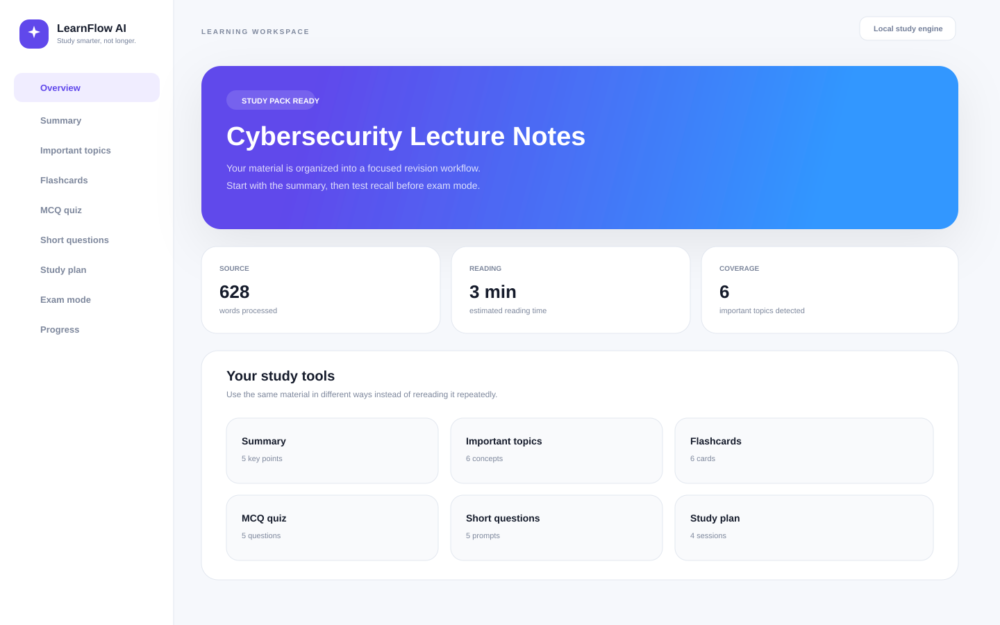

# LearnFlow AI

> AI-powered learning workspace that transforms study materials into summaries, quizzes, flashcards and personalized study plans.



LearnFlow AI is an EdTech portfolio project built around a simple problem: students often have plenty of material but no clear way to turn it into useful revision.

Upload a lecture PDF, a text file, or paste notes directly into the app. LearnFlow reorganizes the material into a study pack that is easier to work through before an exam.

## What it does

- Creates a concise study summary
- Finds important topics in the material
- Builds interactive flashcards
- Generates an MCQ quiz with answer explanations
- Creates short-answer practice questions
- Produces a short study plan
- Includes an exam preparation checklist
- Tracks flashcard, quiz, and exam-mode progress
- Saves the latest study pack in the browser
- Supports dark and light mode
- Uses animated page transitions and a responsive dashboard layout
- Accepts PDF, TXT, and Markdown files

## Demo-friendly by default

The repository does not require an API key to run.

The included study engine is deterministic and runs locally on the server. It ranks recurring terms and relevant sentences to create the study pack. This makes the project easy to clone, test, and show in a portfolio without exposing credentials or paying for model calls.

For a production version, `lib/study-engine.ts` is the place to replace the local generator with an LLM-backed implementation while keeping the same `StudyPack` response shape.

## Tech stack

- Next.js App Router
- TypeScript
- React
- Tailwind CSS
- Framer Motion
- Lucide icons
- `pdf-parse` for server-side PDF text extraction
- Browser `localStorage` for the latest generated study pack

## Project structure

```text
learnflow-ai/
├── app/
│   ├── api/
│   │   └── analyze/
│   │       └── route.ts
│   ├── globals.css
│   ├── layout.tsx
│   └── page.tsx
├── components/
│   ├── learnflow-app.tsx
│   ├── logo.tsx
│   ├── section-title.tsx
│   ├── sidebar.tsx
│   ├── stat-card.tsx
│   ├── study-views.tsx
│   ├── theme-toggle.tsx
│   ├── topbar.tsx
│   └── upload-panel.tsx
├── lib/
│   ├── demo-content.ts
│   ├── study-engine.ts
│   ├── types.ts
│   └── utils.ts
├── public/
│   ├── favicon.svg
│   └── logo.svg
├── screenshots/
│   ├── dashboard-preview.svg
│   └── README.md
├── README.md
├── LICENSE
├── package.json
├── postcss.config.mjs
├── tailwind.config.ts
└── tsconfig.json
```

## Run locally

You need a recent Node.js version installed.

```bash
git clone https://github.com/YOUR-USERNAME/learnflow-ai.git
cd learnflow-ai
npm install
npm run dev
```

Then open `http://localhost:3000`.

If you only want to try the interface, click **Load demo lecture** on the home screen and generate a study pack.

## How the flow works

1. The user uploads a PDF/TXT/Markdown file or pastes notes.
2. `app/api/analyze/route.ts` extracts the text. PDF files are parsed on the server.
3. `lib/study-engine.ts` cleans the material, identifies repeated concepts, scores sentences, and builds a structured `StudyPack`.
4. The frontend renders that same study pack as several learning activities.
5. Flashcard progress, quiz score, and exam-checklist completion feed the progress dashboard.

The important design choice is that the UI does not depend on one particular AI provider. The generator can be replaced later without rewriting the dashboard.

## Main product screens

### Learning workspace

The overview gives the student one place to move between summary, topics, flashcards, quiz, questions, study plan, and exam preparation.

### Flashcards

Cards use a click-to-reveal interaction. Students can mark cards as learned, and that count is reflected in the progress dashboard.

### MCQ quiz

The quiz keeps answers hidden until submission. Correct and incorrect choices are highlighted and a short explanation is shown for every question.

### Exam preparation mode

This is deliberately simple: a no-notes checklist for active recall. Students can tick off each task as they complete it.

## Ideas for the next version

- Connect an LLM for better summaries and question generation
- Add user authentication
- Save multiple courses and study packs in a database
- Add spaced-repetition scheduling for flashcards
- Generate downloadable revision sheets
- Add OCR for scanned lecture PDFs
- Create lecturer/course folders
- Add streaks and weekly study analytics
- Let students choose easy, medium, or hard quiz difficulty

## GitHub repository details

**Repository name**

```text
learnflow-ai
```

**Description**

```text
AI-powered learning workspace that transforms study materials into summaries, quizzes, flashcards and personalized study plans.
```

**Suggested topics**

```text
nextjs typescript edtech ai-study-tool flashcards quiz study-planner student-dashboard tailwindcss portfolio-project
```

## Notes

This is a portfolio-oriented project, so the default implementation favors a clean local demo over external service setup. Do not present the included deterministic generator as a trained machine-learning model. If you connect a real LLM later, update the README to name the provider and explain how user documents are handled.

## License

MIT
